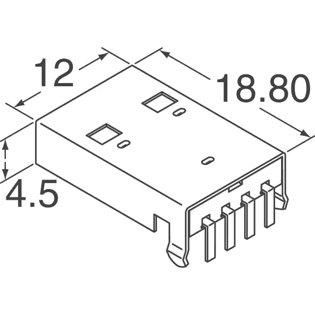
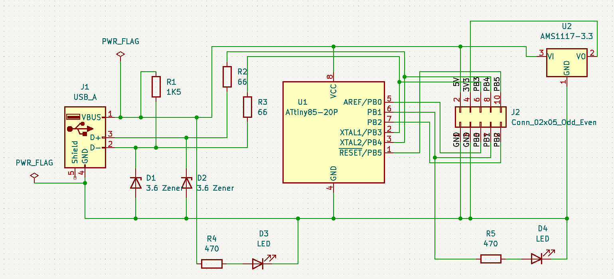
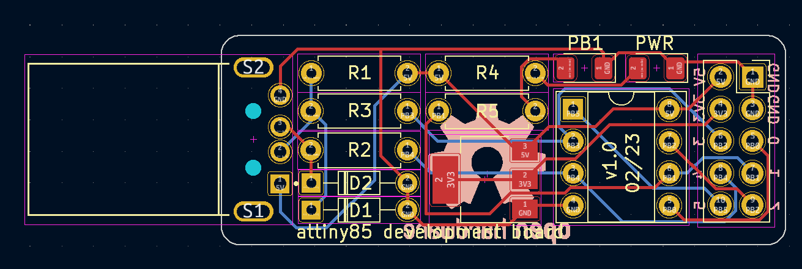
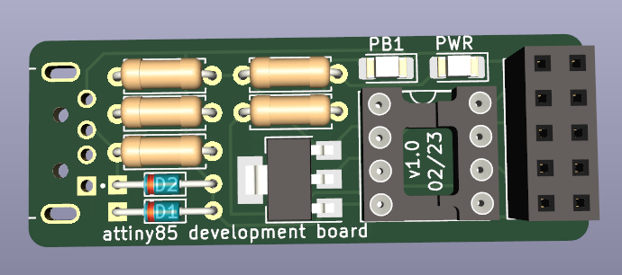
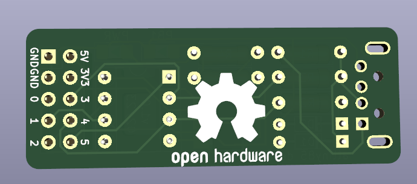

# attiny85 development board

## Features

- All 6 GPIOs from the attiny available (marked 0-5 which corresponds to PB0-PB5 on the attiny)
- 5V output (direct from USB)
- 3V3 output (via AMS1117 voltage regulator)
- Power LED
- Onboard LED connected to PB1
- USB-A connector

The schematic is based on the [Digispark attiny85 devboard](assets/digispark-schematic.pdf).

## Why?

To learn more about electronics and PCB design and also because the Digispark boards don't have a 3V3 output. This board also uses USB-A instead of Micro USB so I don't need any extra cable to connect to my laptop. 

## Custom footprints

I use a custom footprint for the USB connector. You'll need to add it to your Kicad footprint library. It's a standard USB-A male connector with through hole connections for easier soldering (exact type is `MOLEX 48037-0001`, available on aliexpress).

    

## Bill of materials

All of these components can be easily sourced from aliexpress.

- 2x 470Ω (or similar) resistor (for LEDs)
- 1x Green SMD 1206 LED
- 1x Red SMD 1206 LED
- 2x 66Ω (or similar) resistor (for USB)
- 1x 1K5Ω (or similar) resistor (for USB)
- 2x 3V6 Zener diode (for USB)
- 1x AMS1117 SMD voltage regulator (for 3V3 output)
- 1x IC DIP socket 10-pin (for the attiny)
- 1x attiny85 DIP chip
- 1x 2x5 male or female pin header (breakout connectors)
- 1x USB-A male connector, type MOLEX 48037-0001

## Soldering

I'm not great at soldering SMD components so I recommend starting with those. That would be the LEDs and the voltage regulator. After that you can continue with the chip socket and the pin header. You can finish off with the resistors/diodes and the USB connector.

## Programming

The attiny chip needs to be flashed with a bootloader so that you can use it without a programmer (like an Arduino board).
Here are two tutorials that I used to get mine working (you're gonna need an Arduino board to burn the bootloader):

- https://github.com/Jasdoge/Attiny85-Bootloader-Tutorial
- https://circuitdigest.com/microcontroller-projects/attiny85-ic-programming-through-usb-using-digispark-bootloader

These tutorials use the micronucleus bootloader used by the Digispark attiny boards.

There is an onboard LED hardwired to PB1 so you can get your `blink` sketch running without any extra hardware ;)

## Schematics

    
    

## Renders

    
    

